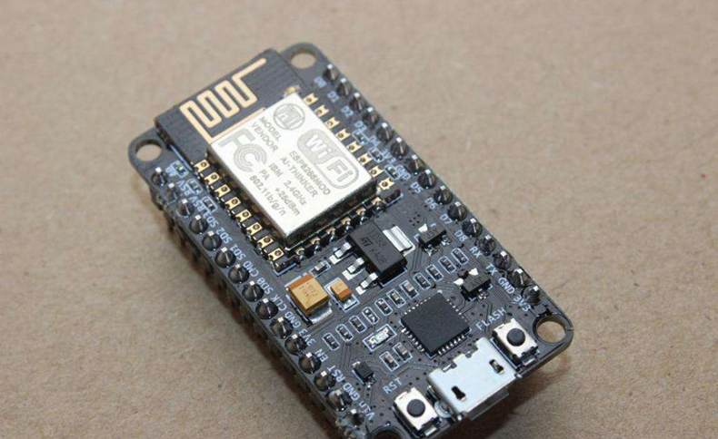
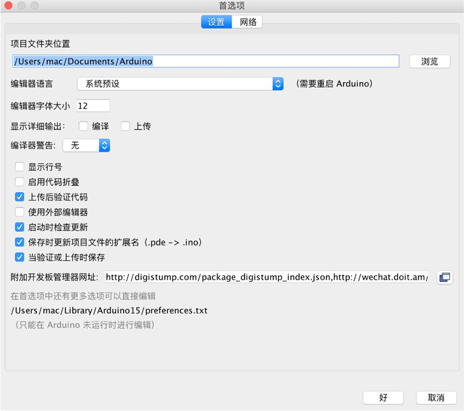
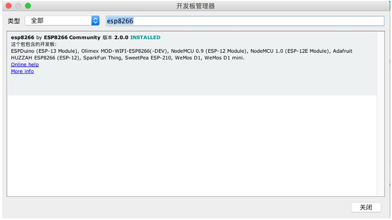
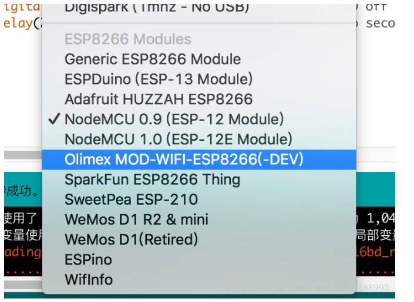
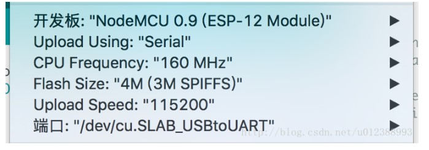
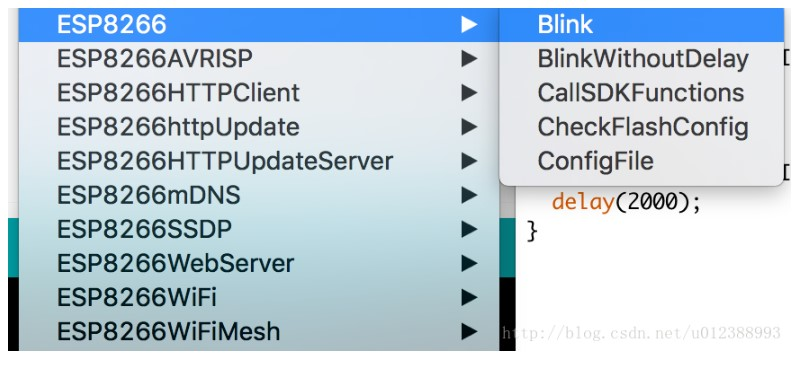

# ESP8266串口wifi模块 NodeMCU Lua V3物联网开发板 CP2102 扩展板

在入门上，可以使用NodeMCU，这一款基于ESP8266的最小系统板来进行开发，价格比最基本的ESP8266模块多50%，但是自带有稳压模块与USB-UART，对于开发来说是更为便捷的，且引脚基本引出，加上面包板在接线上也具有较大的优势。

搭建环境

环境搭建上这里选用基于Arduino来做，版本1.6以上均可，建议在官网下载最新的版本以补足功能，NodeMCU有一个优点也是缺点就是没有固定的IDE，你可以用VisualStudio,Eclipse，Sublime等各种编辑器加上指定编译器进行开发，然而目前并没有什么所谓单步调试的方法，因此调试上主要依赖于AT指令以及串口，这一点在后面的文章将会说明

1.在安装完毕Arduino IDE后，打开文件->首选项，在窗口中的 附加开发板管理器网址 复制以下网址，确定后关闭Arduino再打开

http://wechat.doit.am/package_esp8266com_index.json

2.在菜单栏选择 工具-》开发板-》开发板管理器，打开后等待下载平台索引，然后在 对搜索进行过滤 一栏填写esp8266，选择过滤后得到的唯一一个包并进行安装，这里可能会有失败的情况，需要多尝试，如果白天不行可以尝试在晚上网络使用量较低的时间（例如夜间9-11点）进行下载  

如果安装成功，在工具-》开发板菜单下将具有如下的内容  

3.使用USB线连接NodeMCU，如果端口没有发现USB-UART选项，可以百度查找相应的驱动，MAC下默认是没有CP2102 USB-UART驱动因此如果连接到电脑在端口一栏不会显示。

在 工具 菜单，按照图中所示内容进行配置

4.文件-》示例，选择Blink后将打开一个LED闪烁示例，在窗口上方点击下载按钮下载到开发板上  

如果成功就能看到LED灯按照程序设定进行闪烁，也代表了开发环境配置的完成

附：

MACOS的串口驱动

https://pan.baidu.com/s/1pKEgqmR

github项目网址

https://github.com/esp8266/Arduino/blob/master/doc/reference.md#digital-io

Arduino IDE 1.6.8版本

https://pan.baidu.com/s/1c1NqjBy