# esp8266 nodeMCU arduino开发环境


### ESP8266连接方式

目前ESP8266的开发方式有这几种:

- AT指令方式 –烧录AT的固件包，使用AT指令与ESP8266交互，执行相应指令，需与单片机相连
- NodeMCU的lua开发 –烧录NodeMCU的固件包，使用Lua语言开发，使用ESP内部资源。
- Arduino IDE下的开发 –相当于直接编写固件，编译之后，烧录进ESP，使用ESP内部资源。

### 各种方式的优缺点

- AT指令开发方式：  
  优点：开发简单，资料较多。只需知道AT指令集，以及它的通信方式即可。  
  缺点：浪费资源，需要MCU与其通信，不能独立完成某项功能。
- NodeMCU的lua开发：NodeMCU本质也是ESP8266，只是它的固件是与lua脚本语言交互。  
  优点：节省资源，开发简单，代码量少。  
  缺点：lua解释器执行效率较低，最终换成ArduinoIDE开发，就是因为读取传感器数据时，总是漏掉一个数据。前期准备比较麻烦。需要准备相应功能的固件，烧录进去，然后使用lua语言和工具与之调试。
- Arduino IDE下的开发方式：  
  优点：集编程和烧录一体，使用很方便。语言执行效率高，节省资源，库函数比较多，开发语言简单，能够很快上手。  
  缺点：Arduino IDE需要写较长的代码时，不是很方便，如果需要查看底层函数或者方法，非常费劲。我们也可以通过VisualStudio 中的插件进行开发，这里不做介绍！

### 环境介绍

- 开发环境：
  
  ```css
    arduino版本: 1.8  
    esp8266固件: 2.4.2  
    硬件:NodeMCU   
  ```
  
  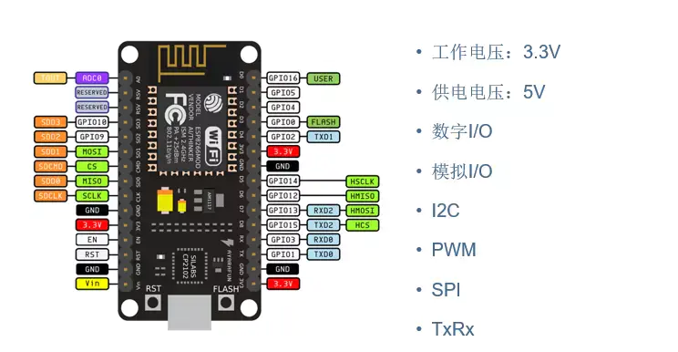
  
  image.png

- 第一步打开arduino，找到文件→首选项。在附加开发板管理中添加下面网址。

```cpp
 http://arduino.esp8266.com/stable/package_esp8266com_index.json
```

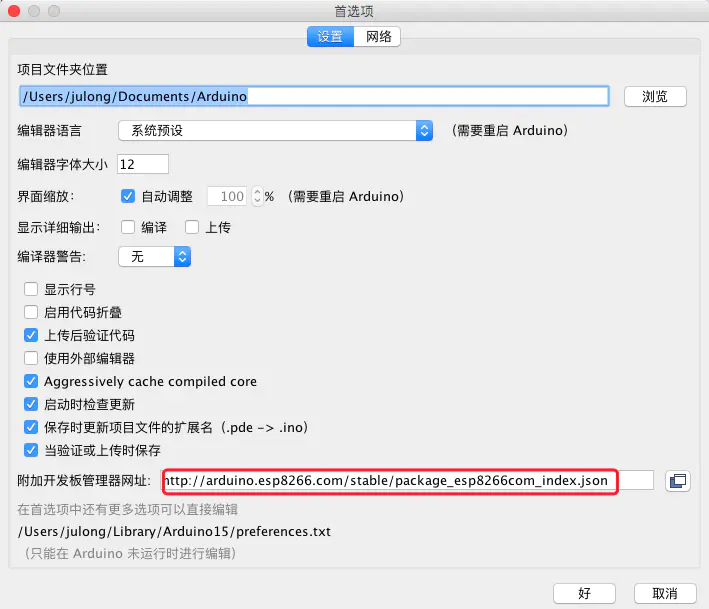

image.png

- 第二步 打开 工具→开发板→开发板管理器
  
  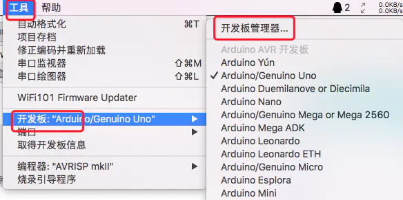
  
  image.png

- 搜索esp8266 进行下载
  
  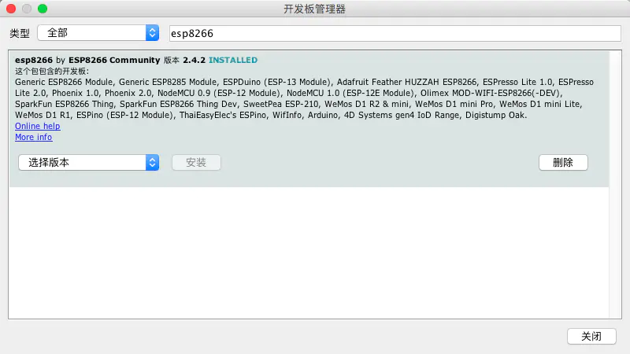
  
  image.png

- 如果安装成功重启arduino

#### 开发板选择并安装驱动

- 选择开发板
  
  在工具栏 → 开发板→ 选择NodeMCU1.0(ESP-12Module)
  
  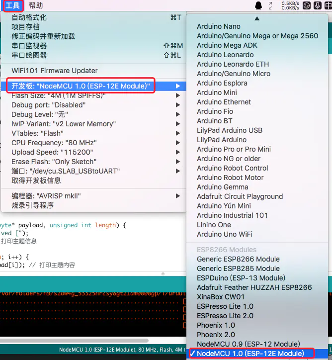
  
  image.png

- 把NodeMCU连接我们的电脑，Windows如果驱动安装失败，下载驱动精灵进行安装！如果电脑是Mac os，电脑无法查到NodeMCU驱动，需要下载下面的串口驱动，安装后重启电脑，在工具→端口中选择刚刚安装的串口工具！
  
  ```cpp
    //Mac OS 串口驱动下载
  
    https://pan.baidu.com/s/1pKEgqmR     
  ```
  
  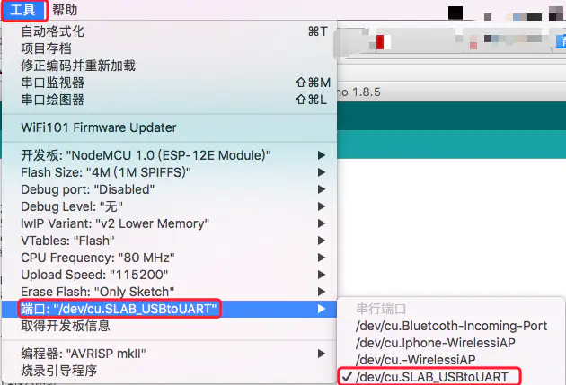
  
  image.png

### 配置测试

- 将NodeMCU通过usb连接到电脑，在工具下选择相应配置，Windows系统下端口选择 COM*，其他设置都相同！
  
  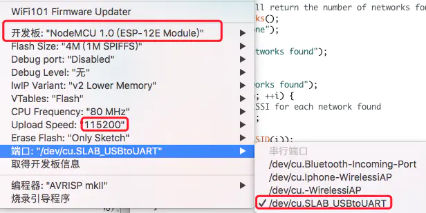
  
  image.png

- 打开示例选择ESP8266WiFi中的WiFiScan
  
  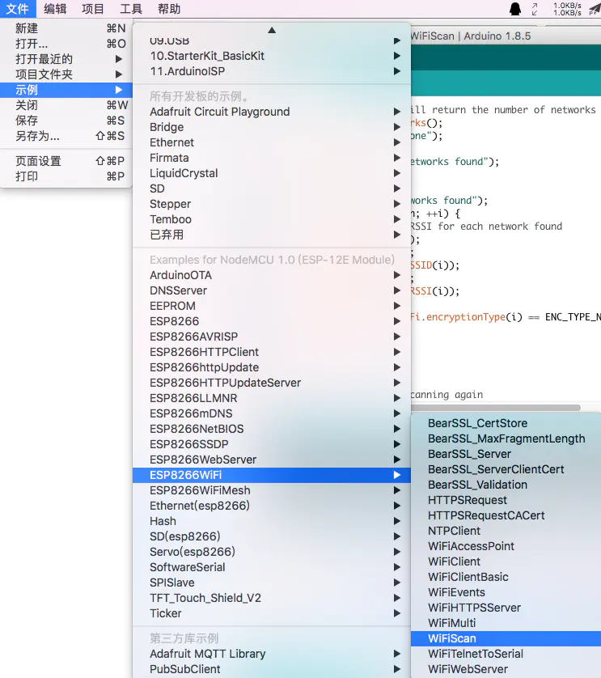
  
  image.png

- 上传到开发板后，上打开窗口监视器，可以看到扫描出来的附近热点，（esp8266上电前，GPIO需要接地）


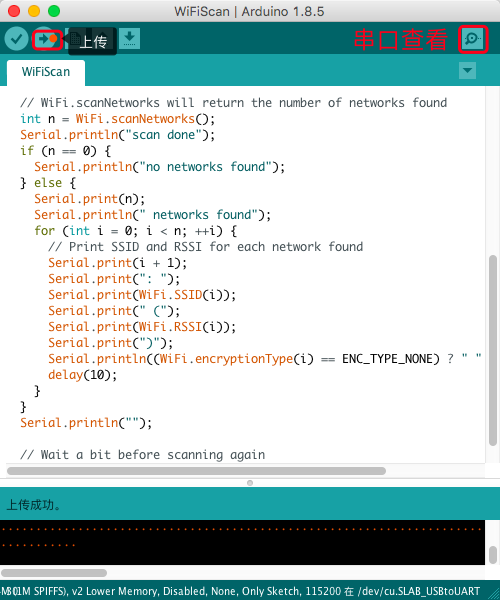


- 打开串口调节波特率成115200，打印出附近的 SSID！
  
  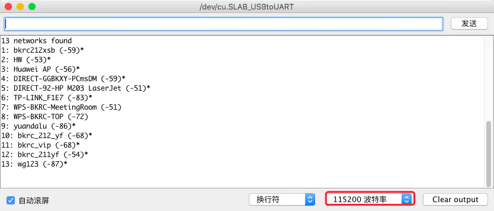
  
  image.png

如果可以成功查找到周围的SSID，说明环境已经配置成功，下麦可以进行esp8266的开发了！

### 普通ESP8266

- 如果是普通的ESP8266，开发版选择Generic ESP8266 Module！在上传烧写过程控制台没有打印信息。ESP8266也不会闪烁。没有任何反应，等待一会出现上传成功！拔掉跳线帽使GPIO0悬空，再次供电即可使用！

  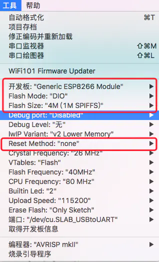

  image.png

作者：高巨龙  
链接：https://www.jianshu.com/p/58f71aeb6633  
来源：简书  
著作权归作者所有。商业转载请联系作者获得授权，非商业转载请注明出处。